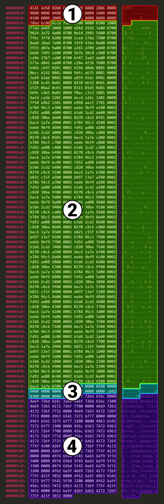
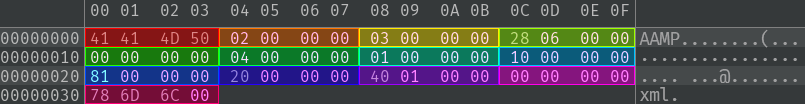
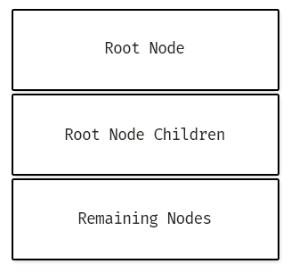

# AAMP File Specification

AAMP files are compressed xml files.

Number values are read in **Little Endian** even though the PowerPC and most Wii U files use Big Endian

### AAMP File Layout



1. AAMP Header
2. Node Buffer
3. Data Buffer
4. String Buffer

## AAMP Header

### Header Layout



| Offset | Size (bytes) | Type | Description |
|--:|:-:|---|---|
| `0x00` | 4 | String | AAMP file signature (magic) `41 41 4D 50` or "AAMP" |
| `0x04` | 4 | Unsigned Int | AAMP version. Should be version 2 |
| `0x08` | 4 | Unknown | Unknown. Usually `03 00 00 00` (Unsigned Int `3`) |
| `0x0c` | 4 | Unsigned Int | File size in bytes |
| `0x10` | 4 | Unknown | Unknown. Usually `00 00 00 00` (Unsigned Int `0`) |
| `0x14` | 4 | Unsigned Int | File extension name length |
| `0x18` | 4 | Unsigned Int | Number of root nodes |
| `0x1c` | 4 | Unsigned Int | Number of child nodes on the root node |
| `0x20` | 4 | Unsigned Int | Number of nodes excluding root nodes and root child nodes (direct descendants) |
| `0x24` | 4 | Unsigned Int | Data buffer size in bytes |
| `0x28` | 4 | Unsigned Int | String buffer size in bytes |
| `0x2c` | 4 | Unknown | Unknown. Usually `00 00 00 00` (Unsigned Int `0`) |
| `0x30` | n | String | A null-terminated string of the resulting file type. Usually `xml\0` The length is equal to value found in `0x14-0x17` (usually 4 bytes). |

The root node follows immediately after the header

### Example

`Lynel_Junior.bdrop`

**Remember** all integers are stored in _Little Endian_ in AAMP files.

| Name | Hex Value | Type | Value |
|---|--:|:-:|---|
| Signature | `41 41 4D 50` | string | `AAMP` |
| Version | `02 00 00 00` | unsigned int 32 | `2` |
| Unknown 0x08 | `03 00 00 00` | unsigned int 32 | `3` |
| File Size | `28 06 00 00` | unsigned int 32 | `1576` |
| Unknown 0x10 | `00 00 00 00` | Unknown |  |
| File Extension Length | `04 00 00 00` | unsigned int 32 | `4` |
| Root Nodes Count | `01 00 00 00` | unsigned int 32 | `1` |
| Root Node Children Count | `10 00 00 00` | unsigned int 32 | `16` |
| Remaining Nodes | `81 00 00 00` | unsigned int 32 | `129` |
| Data Buffer Size | `20 00 00 00` | unsigned int 32 | `32` |
| String Buffer Size | `40 01 00 00` | unsigned int 32 | `320` |
| Unknown 0x2c | `00 00 00 00` | Unknown | |
| File Extension | `78 6D 6C 00` | string | `xml`

## Nodes

### Node Buffer Layout



### Root Node

```
         | 00 01  02 03  04 05  06 07  08 09  0a 0b  0c 0d  0e 0f |
---------+--------------------------------------------------------+-----------------
00000000 | 6C CB  F6 A4  03 00  00 00  03 00  10 00               | l...........
```

| Offset | Size | Type | Description |
|--:|:-:|---|---|
| `0x00` | 4 | Unsigned Int | Node ID. `6C CB F6 A4` |
| `0x04` | 4 | Unknown | Unknown. `03 00 00 00`, `03 00 01 00` |
| `0x08` | 2 | Unsigned Int | Data offset relative to beginning node address |
| `0x0a` | 2 | Unsigned Int | Child node count |

### Node

```
         | 00 01  02 03  04 05  06 07  08 09  0a 0b  0c 0d  0e 0f |
---------+--------------------------------------------------------+-----------------
00000000 | F7 AD  DE 69  20 00  10 00                             | ...i ...
```

| Offset | Size | Type | Description |
|--:|:-:|---|---|
| `0x00` | 4 | Unsigned Int | Node ID. |
| `0x04` | 2 | Unsigned Int | Offset to first child node in bytes |
| `0x06` | 1 | Unsigned Int | Child node count |
| `0x07` | 1 | Unsigned Int | Node data type |

The offset is calculated by multiplying the number of bytes by 4 and adding it to the node address

### Node Data Types

Each node has a data type to determine how to correctly parse the node value. If a node's child count is greater than 0
it is _always_ a node regardless of the data type indicated.

| Data Type | Value | Node Size (bytes) | Description |
|---|--:|:-:|---|
| Node | `0x00` | 4 | The current node has child nodes |
| Boolean | `0x00` | | `true` or `false` |
| Float | `0x01` | 4 | [Half Precision Floating-point number](https://en.wikipedia.org/wiki/Half-precision_floating-point_format) |
| Int | `0x02` | 4 | 16-bit Integer |
| Vector2 | `0x03` | | Vector array with two floating-point numbers `x`, `y` |
| Vector3 | `0x04` | | Vector array with three floating-point numbers `x`, `y`, `z` |
| Vector4 | `0x06` | | Vector array with four floating-point numbers `x`, `y`, `z`, `w` |
| String | `0x07` | | A sequence of characters |
| Actor | `0x08` | | A hashed reference to an BotW Actor object |
| UnknownString | `0x0f` | | |
| UnknownUnsignedInt | `0x11` | | |
| String2 | `0x14` | | |

## AAMP Checksum

Method for calculating a checksum to verify correct parsing:

1. Get file total size in bytes (`0x0c`)
2. Get total number of nodes (`0x18`, `0x1c` & `0x20`)
3. Get data and string buffer sizes (`0x24` & `0x28`)
4. Total the bytes
    * 52 bytes for the AAMP header
    * 12 bytes per root node
    * 8 bytes per child node
        * Size depends on data type
  
### Example

For example, `Lynel_Junior.bdrop`:

```
total file size:            1576  bytes
total number of nodes:      146
data buffer size:           32    bytes
string buffer size:         320   bytes

aamp header:                52    bytes
1 root node * 12 bytes:     12    bytes
145 nodes * 8 bytes:        1160  bytes
data buffer:                32    bytes
string buffer:            + 320   bytes
                         ---------------
total size:                 1576  bytes
```